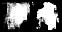
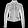

# Conditional Diffusion Models
This is an easy implementation based on the repository (https://github.com/dome272/Diffusion-Models-pytorch). The Diffusion model is based on [DDPM](https://arxiv.org/pdf/2006.11239.pdf) paper, and the conditioning idea is taken from [Classifier-Free Diffusion Guidance]
(https://arxiv.org/abs/2207.12598).

<hr>

## Train the Model on Fashion-MNIST:

1. Configure Hyperparameters in ```main.py```
2. Set dataset usage in ```utils.py```
3. ```python main.py```

## Sampling
The ```generate.py``` file shows how to sample images using the model's saved checkpoints in "models/DDPM_conditional".

```bash
python generate.py
```

<hr>

## Result
I just used a CPU to train the model for 6 epochs, and got the following results for 2 generated samples:



Compared to the target image:




The results definetely can be improved with long training and tuning time.

## Evaluation
To quantitatively evaluated the generated results, some metrics can be used, such as FID, CLIP. Due to the time limit, the FID and CLIP metrics are not implemented here.

## Problem approach and time breakdown
1. Read the task document and understanding the requirements. (10:19 - 10:29)
2. Given that I have applied the referred code before in my own projects, I chose to reuse the code in my local folder. 
3. I modified the code to make it fits the Fashion-MNIST dataset as the unchanged code is used in RGB not grayscale, and in different input image size. (10:29 - 11:15)
4. I added a simple ```generate.py``` as the entry point to load the model and generate a new fashion image from a random vector and a conditional vector. In practice, I chose one of the images from the validation set to be able to visualize and compare the results. (11:15 - 11:32)
5. Test the different modules. (11:32 - 12:30)
6. Start training for just 1 epoch and debugging. (13:30 - 14:27)
7. After everything works, I start training for 6 epochs. (14:30 - 15:46)
8. Test the saved trained model to generate results. (15:50 - 16:23) 
9. I refactored the code and the structure of the project. (17:45 - 18:25)
10. Write the documentation.
11. Further refinement and refactoring the code can be done, such as have config files, seperate Dataset class, etc.

<hr>
Thank you for reviewing the code and reading! :)